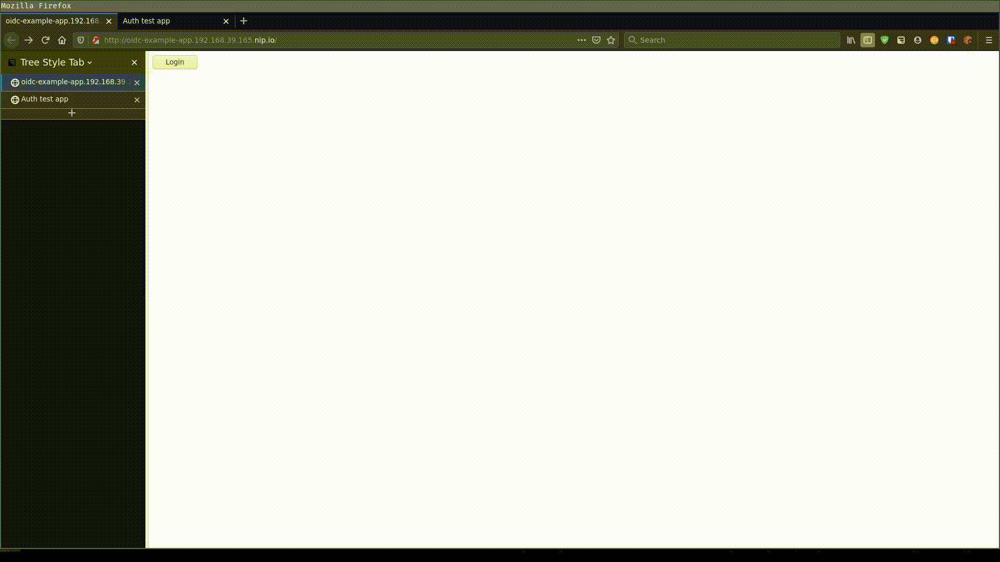

# Setup minikube with Dex

## How to run it
Simply run the scripts in order:
```
$ cd che-auth-playground/minikube_dex
$ ./01_minikube_start.sh
$ ./02_certs.sh
$ ./03_dex.sh
$ ./04_minikube_apiserver.sh
$ ./11_tokenapp.sh
$ ./12_testapp.sh
```

## How to use it

1. First open the token app webpage, should be on `http://oidc-example-app.<minikube ip>.nip.io`
1. Login and copy the token
1. Open the test app, should be on `http://che-auth-testapp.<minikube ip>.nip.io`
1. Paste the token
1. To test the RBAC rules, user `che@eclipse.org` has admin permissions to `che` namespace



## What it does

See the scripts for more details.

#### 01_minikube_start.sh
Starts simple minikube instance

#### 02_certs.sh
Generates self-signed tls certificates for subdomains of minikube's ip `*.$( minikube ip ).nip.io`. Copies certificate authority into minikube folder, so _apiserver_ can later see it. __Don't forget to import `ssl/ca.pem` into your browser.__

#### 03_dex.sh
Deploys dex with specific configuration to this minikube instance. There is six static users set with credentials `che@eclipse.org:password` and `user[1-5]@che:password`. Optionally set GITHUB_CLIENT_ID and GITHUB_CLIENT_SECRET env variables prior running this script, to have github authentication working.

#### 04_minikube_apiserver.sh
Configures minikube apiserver with dex as oidc provider.

#### 11_tokenapp.sh
Deploys dex's example app https://github.com/dexidp/dex/tree/master/examples/example-app. With this web app it's easy to get the oidc token.

#### 12_testapp.sh
Deploys my authentication test app https://github.com/sparkoo/che-auth-testapp. This is useful to test if authentication and authorization with the token is actually working. This will add admin permissions to namespace `che` for user `che@eclipse.org`.

#### 13_prepareNamespaces.sh
Creates 5 namespaces `user[1-5]` with admin permissions for corresponding user.
