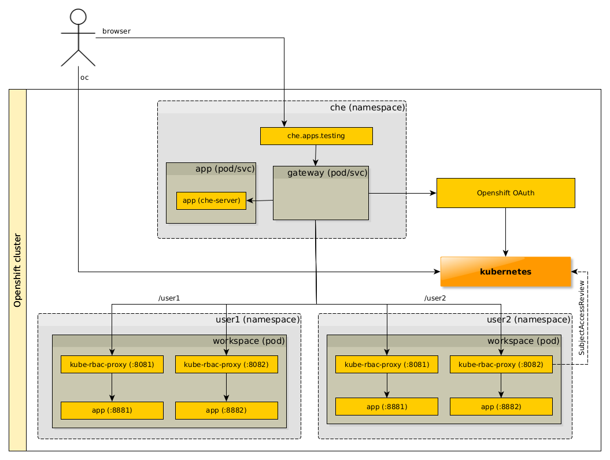
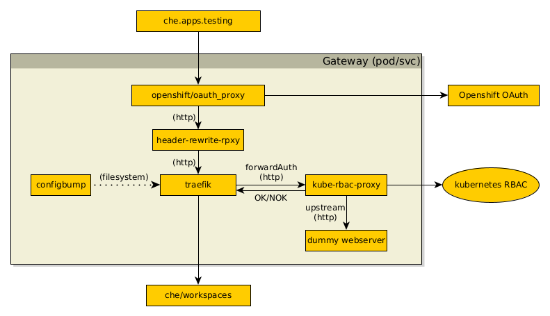

# Setup minikube instance with authentication and authorization for multiple applications in different namespaces

## How to run
  1. Have openshift cluster with oc/kubectl configured
  2. set cluster hostname  to `CLUSTER_HOSTNAME` env variable (`export CLUSTER_HOSTNAME=apps.openshift.cluster`)
  2. Deploy the gateway with `./01_gateway.sh`
  3. Deploy the user's application (workspace)
    1. Go to `workspace` folder -> `$ cd workspace`
    1. Run `./01_deploy.sh user1` (or other valid user `user[1-5]`).
    1. Deploy for at least one more user

## How it works

### Diagram
(gateway is blackbox here. See next image.)

### Gateway

Gateway covers couple of responsibilities here:
  - Authentication
    - __openshift/oauth_proxy__ ensures all incoming requests are authenticated. If user has no auth cookie, it redirects user to authentication page.
    - oauth_proxy can pass user's openshift token to upstream application only in `X-Forwarded-Access-Token` header. However, we need it in `Authorization` header. For that we have here __header-rewrite-rpxy__ (https://github.com/sparkoo/header-rewrite-rpxy), that takes the `X-Forwarded-Access-Token` header value, and puts it into `Authorization: Bearear <token>` header.
  - Authorization
    - __Traefik__ uses forwardAuth middleware (https://doc.traefik.io/traefik/middlewares/forwardauth/) with target of kube-rbac-proxy to allow/deny the request. __Kube-rbac-proxy__ uses non-resource RBAC cluster rules (see [/kube-rbac-proxy/route-config.yaml](../kube-rbac-proxy/route-config.yaml#L54)). "Dummy webserver" is there only as a blackhole upstream for kube-rbac-proxy.
  - Routing
    - Classic routing with treafik as we know it from single-host Che, except for Authorization middleware described above ^^

## How to test
The user's applications are exposed on `https://che.<cluster-host>/user[1-n]`. Only matching user should have access to the endpoints, other should see something like `Forbidden (user=user3, verb=get, resource=, subresource=)`.

The demo application is doing some requests to k8s with bearer token. Logged user should have access only to his/her namespace. If you try to request different namespace, you shold see in the output something like `configmaps is forbidden: User "user1" cannot list resource "configmaps" in API group "" in the namespace "user2"`.

## Notes
I wasn't able to run upstream kube-rbac-proxy (https://github.com/brancz/kube-rbac-proxy) on Openshift. I was getting error events like `chdir to cwd (\"/home/nonroot\") set in config.json failed: permission denied` and kube-rbac-proxy containers in pod won't start. That should be fixable by explicitly setting the userid for the kube-rbac-proxy container (like here https://github.com/prometheus-operator/kube-prometheus/pull/803/files), but then Openshift complains with `Invalid value: 65532: "must be in the ranges: [1000630000, 1000639999]]"` and pod won't even get scheduled to start. At the end I've used __openshift/kube-rbac-proxy__ fork, which fixes this issue (https://github.com/openshift/kube-rbac-proxy).